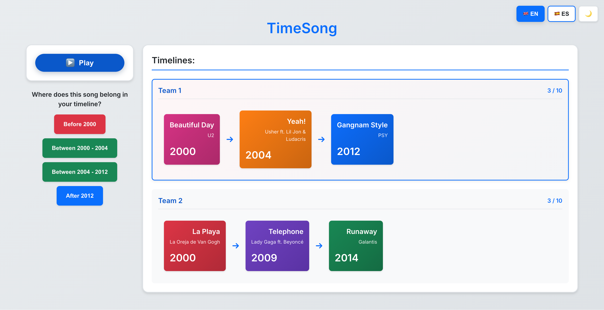

[](https://github.com/davidpastorvicente/chronotunes/actions/workflows/deploy.yml)

# ChronoTunes

A timeline guessing game where players build chronological timelines by placing items in order. Play with songs, movies, or TV shows!



## 🎮 How to Play

1. **Choose Category**: Select between Songs or Movies/TV Shows
2. **Setup Players**: Choose 2-6 players and set a winning score (5, 10, 15, or 20 items)
3. **Experience**: Each turn, a player experiences a mystery item (song audio or movie/show image)
4. **Guess**: Place the item in your timeline by its year (before, between, or after existing items)
5. **Build**: Correct placements add the item to your timeline
6. **Win**: First player to reach the target number of items wins!

## 📚 Content Library

### 🎵 Music (436 Songs Total)

**English Songs (278 songs):**
- 1960s-1990s: Classic hits from The Beatles, Queen, Michael Jackson, Nirvana
- 2000s-2020s: Modern anthems from Beyoncé, Ed Sheeran, The Weeknd, Billie Eilish  
- 2010s party hits: Rihanna, Lady Gaga, Calvin Harris, Ariana Grande, Justin Bieber

**Spanish/Latin Songs (158 songs):**
- Heavy emphasis on reggaeton and Latin pop
- Artists: Bad Bunny, Karol G, Ozuna, Rauw Alejandro, Maluma, ROSALÍA, Shakira
- Spanish pop/rock: La Oreja de Van Gogh, Amaral, El Canto del Loco, Mecano, Héroes del Silencio
- Focus on post-2000 music with 70+ songs from 2020s alone

### 🎬 Movies & TV Shows (200 Items Total)

**English Movies/Shows (100 items):**
- Classic films and iconic TV series from 1960s-2020s
- Mix of blockbusters, critically acclaimed films, and popular TV shows

**Spanish Movies/Shows (100 items from Spain):**
- Spanish cinema and television from Spain specifically
- Filtered by origin country to ensure authentic Spanish content

## 🎧 Media Playback

**For Songs:**
- **Deezer API**: ~99% of songs play ad-free 30-second previews via Deezer
- **YouTube Fallback**: Remaining songs use YouTube embed (may show ads)
- Preview URLs are fetched dynamically at runtime for freshness
- CORS proxy fallback chain ensures reliability

**For Movies/TV Shows:**
- **Backdrop Images**: Scene stills shown during guessing phase (harder to identify)
- **Poster Images**: Official posters shown on reveal (clear identification)
- Images fetched from TMDB API with permanent URLs

## 🚀 Getting Started

```bash
# Install dependencies
npm install

# Start development server
npm run dev

# Open browser to http://localhost:5173
```

## 🛠 Tech Stack

- **React** - UI framework
- **Vite** - Build tool & dev server
- **Firebase Realtime Database** - Multi-device sync
- **Deezer API** - Ad-free audio previews (30 seconds)
- **TMDB API** - Movie/TV show data and images
- **YouTube Embeds** - Fallback audio playback
- **CSS3** - Modern styling with theme system

## 🎯 Content Sources

### Songs
- **Data structure**: Title, artist, year, YouTubeId, DeezerId
- **Playback**: Deezer preview URLs (fetched at runtime, expire after 24h)
- **Album covers**: Fetched at runtime from Deezer API
- **Fallback**: YouTube embeds for songs without Deezer previews

### Movies/TV Shows
- **Data structure**: Title, year, backdropUrl, posterUrl, tmdbId, type
- **Images**: TMDB permanent URLs (don't expire)
- **Hint phase**: Backdrop images (scene stills)
- **Reveal phase**: Poster images (official artwork)
- **Origin filtering**: Spanish content filtered by Spain specifically

## 🔧 Key Features

### Color-Coded Timelines
- Each player gets a unique shuffled color sequence (8 colors)
- Colors assigned per-item, not per-position
- Item colors remain stable even when timeline reorders
- Uses seeded Fisher-Yates shuffle with Linear Congruential Generator (LCG)

### Media-Agnostic Architecture
- Generic terminology: "items" instead of "songs"
- `category` field: 'songs' or 'movies'
- `contentSet` field: 'everything', 'english', 'spanish', or 'new' (2010+)
- Components work across all media types
- Easy to extend with new categories in future

## 📝 Features

- ✅ **Multiple categories**: Songs, Movies, and TV Shows
- ✅ Turn-based gameplay for multiple players
- ✅ **Single-device mode** (hot-seat multiplayer)
- ✅ **Multi-device mode** (real-time sync via Firebase)
- ✅ Configurable winning conditions
- ✅ **Content filtering**: Everything, English only, Spanish only, or Recent (2010+)
- ✅ Hidden media (audio for songs, scene images for movies/shows)
- ✅ Play/Pause controls for audio
- ✅ Visual timeline display with color-coded cards
- ✅ Per-item color stability (colors don't change between turns)
- ✅ Immediate feedback on correct/incorrect placements
- ✅ Winner announcement with full timeline
- ✅ Modern dark/light theme UI
- ✅ Bilingual support (English/Spanish)

## 🎨 Customization

### Adding Movies/TV Shows from TMDB

Use the automated script to fetch movies and TV shows:

```bash
python3 scripts/fetch-movies.py

# For Spanish content (from Spain only):
python3 scripts/fetch-movies.py --language es

# Limit number of items:
python3 scripts/fetch-movies.py --limit 50
```

**Requirements:**
- TMDB API key (set as `TMDB_API_KEY` environment variable)
- Both `backdrop_path` AND `poster_path` must be present
- Spanish content filtered by origin country (Spain only)

The script will:
- ✅ Fetch movies and TV shows from TMDB `/discover` endpoints
- ✅ Filter by origin country for Spanish content (`with_origin_country=ES`)
- ✅ Include backdrop URLs (for hint phase) and poster URLs (for reveal phase)
- ✅ Generate `src/data/movies/english.js` or `spanish.js`
- ✅ Include title, year, backdrop, poster, TMDB ID, and type (movie/tvshow)

### Checking for Duplicates

Check for duplicate songs in the database:

```bash
python3 scripts/check-duplicates.py
```

This will scan both English and Spanish song databases for:
- 🔴 Duplicate Deezer IDs
- 🔴 Duplicate YouTube IDs  
- 🔴 Duplicate titles (case-insensitive)

**When duplicates are found**, the script automatically:
1. Re-fetches the correct YouTube ID for each song (using `ytmusic.search()`)
2. Re-fetches the correct Deezer ID for each song (using Deezer search API)
3. Shows you the new correct IDs

**To automatically fix the files:**
```bash
python3 scripts/check-duplicates.py --fix
```

This will update the data files with the correct IDs.

### Validating Song Titles

Validate that song titles in the database match Deezer API:

```bash
python3 scripts/check-titles.py
```

This will:
- Fetch the actual title from Deezer API using each song's `deezerId`
- Compare it with the title stored in the database
- Flag any mismatches (ignoring accents, case, and special characters)

**Note:** Some mismatches are acceptable (e.g., remaster notes, featured artists). The database intentionally keeps cleaner titles while Deezer includes extra metadata like "(Remastered 2015)" or "(feat. Artist)".

### Adding Songs from YouTube Playlists

Use the automated script to add entire playlists:

```bash
python3 scripts/add-playlist.py PLAYLIST_ID

# Or with full URL:
python3 scripts/add-playlist.py "https://music.youtube.com/playlist?list=..."

# For Spanish songs:
python3 scripts/add-playlist.py PLAYLIST_ID --language es

# For large playlists, limit to first N successful imports:
python3 scripts/add-playlist.py PLAYLIST_ID --limit 50
```

The script will:
- ✅ Fetch all tracks from the playlist (titles and artists)
- ✅ Clean titles by removing parentheses/brackets (done twice: before search and after receiving YouTube data)
- ✅ Optionally process until N songs are successfully imported
- ✅ Search for official YouTube video IDs (ensures best/canonical versions)
- ✅ Get YouTube IDs, Deezer IDs, album covers, and years
- ✅ Remove duplicates automatically
- ✅ Append formatted songs to `src/data/songs/english.js` or `spanish.js`

**Note:** When using `--limit 50`, the script keeps processing songs until 50 are successfully imported (skipping any that fail).

### Adding Individual Songs

To add songs manually, edit `src/data/songs/english.js` or `spanish.js` and add entries **without any IDs**:

```javascript
{
  title: "Your Song Title",
  artist: "Artist Name",
  year: 2024
}
```

Then run the automatic ID updater:

```bash
python3 scripts/update-ids.py
```

The script will automatically:
- ✅ Fetch YouTube IDs from YouTube Music API
- ✅ Fetch Deezer IDs from Deezer API (for ad-free playback)
- ✅ Update the data files with both IDs

### Manual ID Entry

You can also add songs with IDs directly:

```javascript
{
  title: "Your Song Title",
  artist: "Artist Name",
  year: 2024,
  youtubeId: "youtube_video_id",  // Required
  deezerId: "deezer_track_id"     // Required
  // Note: Do NOT add albumCover or previewUrl - these are fetched at runtime
}
```

For movies/TV shows:

```javascript
{
  title: "Movie Title",
  year: 2024,
  backdropUrl: "https://image.tmdb.org/t/p/original/...",  // Scene image for hints
  posterUrl: "https://image.tmdb.org/t/p/original/...",    // Poster for reveal
  tmdbId: "12345",
  type: "movie"  // or "tvshow"
}
```

## 📦 Project Structure

```
src/
├── components/
│   ├── GameSetup.jsx            # Player & category configuration
│   ├── GameBoard.jsx            # Main game logic (single-device)
│   ├── MultiplayerGameBoard.jsx # Multiplayer wrapper (Firebase sync)
│   ├── Timeline.jsx             # Timeline display (color-coded cards)
│   ├── MediaPlayer.jsx          # Routes to SongPlayer or ImageHint
│   ├── SongPlayer.jsx           # Audio player for songs
│   ├── ImageHint.jsx            # Image display for movies/shows
│   └── PlacementButtons.jsx     # Placement controls
├── data/
│   ├── songs.js                 # Song sets export
│   ├── songs/
│   │   ├── english.js           # 278 English songs
│   │   └── spanish.js           # 158 Spanish songs
│   ├── movies.js                # Movie sets export
│   └── movies/
│       ├── english.js           # 100 English movies/shows
│       └── spanish.js           # 100 Spanish movies/shows
├── utils/
│   └── deezer.js                # Deezer API with CORS proxy fallback
├── services/
│   └── gameSession.js           # Firebase operations
├── translations.js              # English/Spanish translations
└── App.jsx                      # Root component
```

## 🎯 No API Keys Required!

This version uses a curated song list - just clone and play!

---

Enjoy the game! 🎵
